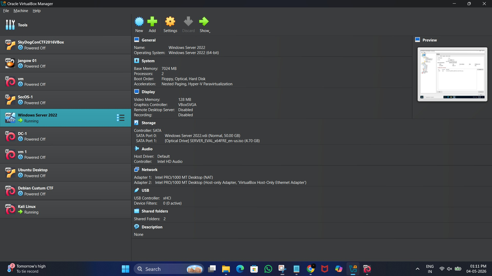
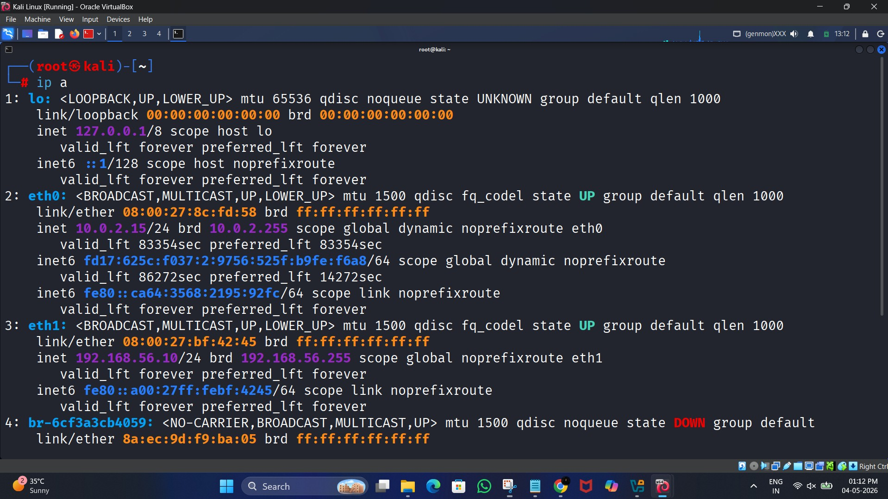
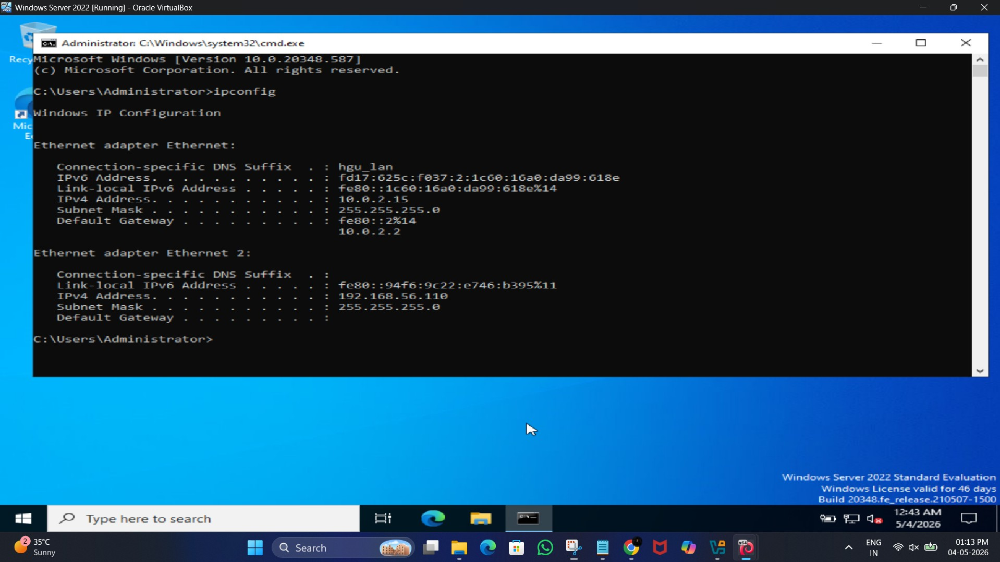
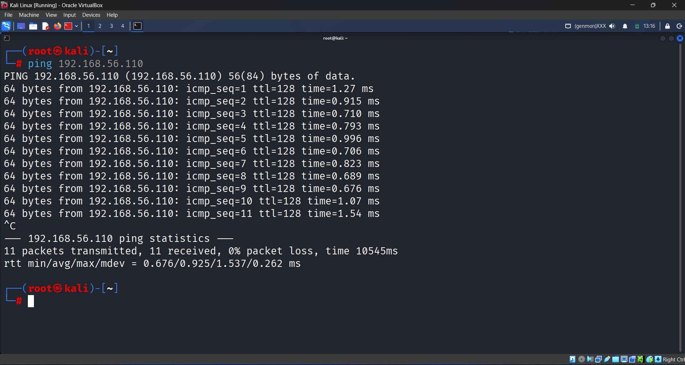
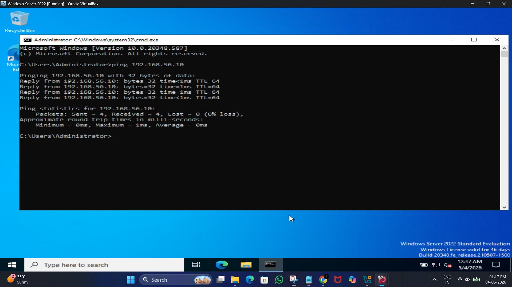

<h1 align="center">📸 Investigation Evidence — Screenshots Guide</h1>

This folder contains all the visual evidence collected during the phishing email investigation performed in this SOC lab.

Each screenshot represents an important step of the investigation workflow followed by a SOC Analyst, from lab setup to forensic analysis and reporting.

  

## 🖥️ VM Setup & Network Connectivity

| Screenshot | Description |
|---|---|
|  | Both Kali Linux and Windows Server 2022 virtual machines running in VirtualBox |
|  | Shows the IP address of the attacker machine (Kali Linux) |
|  | Shows the IP address of the victim mail server |
|  | Ping test from Kali Linux to Windows Server |
|  | Ping test from Windows Server to Kali Linux |

  

## ⚙️ hMailServer Configuration

| Screenshot | Description |
|---|---|
|  | Domain configured inside hMailServer |
|  | Mailbox account created for the victim user |
|  | SMTP service enabled and configured |

  

## 🎣 Phishing Email Attack Simulation

| Screenshot | Description |
|---|---|
|  | swaks command used to send the phishing email from Kali Linux |
|  | Confirmation that the phishing email was successfully sent |

  

## 📬 Mail Server Logs & Email Delivery

| Screenshot | Description |
|---|---|
|  | Mail server logs showing successful email delivery |
|  | Phishing email received in the victim mailbox |

  

## 🧪 Email Header Forensic Analysis

| Screenshot | Description |
|---|---|
|  | Raw email header opened for analysis |
|  | Received header showing the real sender IP address |
|  | Evidence of spoofed sender email address |

  

## 🚨 IOC Extraction

| Screenshot | Description |
|---|---|
|  | Malicious IP extracted from email header |
|  | Phishing URL extracted from email body |

  

## 🌐 Threat Intelligence Validation

| Screenshot | Description |
|---|---|
|  | VirusTotal result for the attacker IP |
|  | VirusTotal result for the phishing URL |

  

## 🗺️ MITRE ATT&CK Mapping

| Screenshot | Description |
|---|---|
|  | Mapping the phishing attack to MITRE ATT&CK technique T1566 |

  

## 📝 SOC Incident Report

| Screenshot | Description |
|---|---|
|  | Final SOC incident report prepared based on the investigation |

  

These screenshots serve as forensic proof of the phishing simulation, investigation process, IOC validation, and MITRE ATT&CK mapping performed in this SOC lab.
